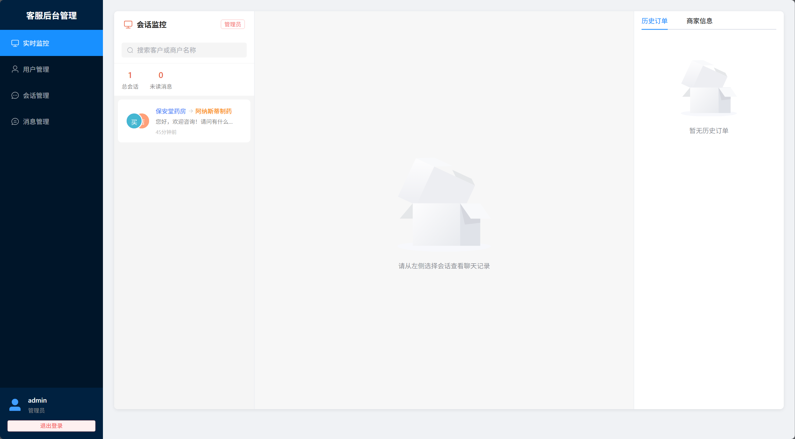
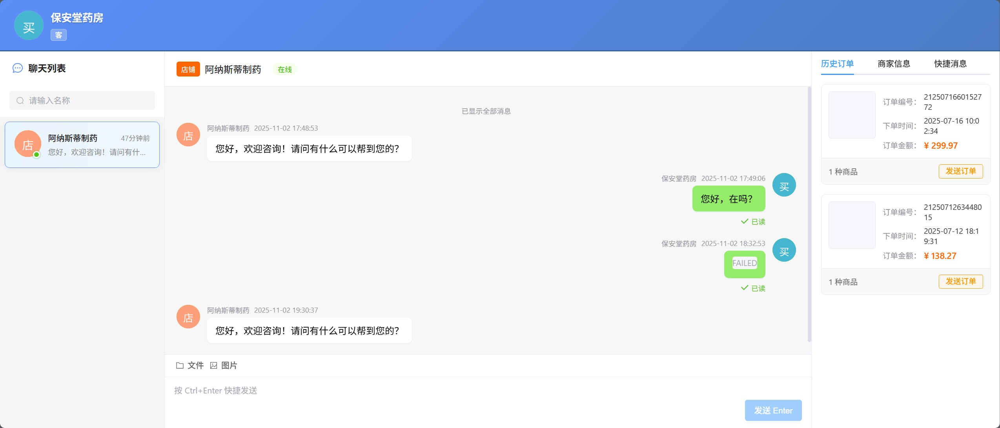

# 在线客服系统

基于 FastAPI + MySQL + Vue3 + WebSocket 的实时在线客服系统，支持多角色（买家、商户、官方客服、管理员）在线沟通。

## ✨ 核心特性

- 🚀 **实时通信** - WebSocket 双向通信，消息即时送达
- 👥 **多角色支持** - 买家、商户、官方客服、管理员
- 📱 **响应式设计** - 完美适配桌面端和移动端
- 💬 **快捷回复** - 自定义快捷消息，提升沟通效率
- 📎 **文件传输** - 支持图片、文档等文件上传和预览
- 🔒 **JWT 认证** - 安全的用户身份验证
- 📊 **管理后台** - 实时监控、用户管理、数据统计
- 🎨 **现代化 UI** - Element Plus 组件库，界面美观易用

## 📸 界面预览

### 客服后台管理


### 聊天界面


### 移动端适配


## 🛠️ 技术栈

**后端：** Python 3.11 | FastAPI | MySQL | SQLAlchemy | Alembic | WebSocket  
**前端：** Vue 3 | Vite | Element Plus | Pinia | Vue Router | Axios

## 📋 环境要求

Python 3.11+ | Node.js 20+ | pnpm 8+ | MySQL 5.7+/8.0+

## 🚀 快速开始

```bash
# 1. 克隆项目
git clone <repository-url>
cd live_chat

# 2. 后端配置
cd backend
cp .env.example .env           # 编辑配置（16项必需）
pip install -r requirements.txt
alembic upgrade head
python create_admin.py         # 创建管理员
python main.py                 # 启动后端

# 3. 前端配置（新终端）
cd frontend
cp .env.example .env           # 编辑配置
pnpm install
pnpm dev                       # 启动前端
```

**访问：**
- 前端: http://localhost:5173
- API 文档: http://localhost:11075/api/docs

## 📖 使用教程

### 快速访问

**登录页面：** http://localhost:5173/login

**聊天页面：** http://localhost:5173/chat?user_id={用户ID}&target_user_id={对话对象ID}

**管理后台：** http://localhost:5173/admin?user_id={管理员ID}

### 内置测试用户

| 角色 | 用户ID | 用户名 | 默认密码 |
|------|--------|--------|----------|
| 管理员 | a1, a2 | admin | admin123 |
| 买家 | b1, b2 | 保安堂药房、异世界药局 | （无需密码） |
| 商户 | m1, m2, m3 | 保和堂医药、阿纳斯蒂制药、梅迪西斯制药 | （无需密码） |
| 客服 | p1 | 官方客服 | （无需密码） |

### 使用示例

**1. 买家与商户对话**
```
http://localhost:5173/chat?user_id=b1&target_user_id=m1
```

**2. 商户查看客户列表**
```
http://localhost:5173/chat?user_id=m1
```

**3. 管理员监控**
```
http://localhost:5173/admin?user_id=a1
```

## 💡 功能介绍

### 核心功能

- ✅ 用户管理（买家、商户、客服、管理员）
- ✅ 实时消息推送（WebSocket）
- ✅ 会话管理（创建、查询、列表）
- ✅ 消息发送（文本、图片、文件）
- ✅ 快捷回复（自定义、管理）
- ✅ 文件上传（图片、文档，10MB限制）
- ✅ 管理后台（数据统计、实时监控）
- ✅ 响应式设计（桌面端、移动端）
- ✅ 暗色主题（登录页面优化）

## ❓ 常见问题

**Q: 后端启动失败？**  
检查：Python版本、依赖安装、.env配置（15项必需）、MySQL运行

**Q: 前端无法连接后端？**  
检查：后端运行、端口正确（11075）、.env配置、CORS设置

**Q: WebSocket 连接失败？**  
检查：后端WebSocket服务、URL格式、防火墙

**Q: 多个后端进程端口冲突？**  
原因：后台启动多个进程导致端口被占用  
解决：检查并清理占用端口的进程
```bash
netstat -ano | findstr :11075
taskkill /F /PID <进程ID>
```

**Q: 如何修改端口？**  
后端：修改 `backend/.env` 中的 `PORT`  
前端：修改 `frontend/.env` 中的 `VITE_PORT`

## 🔮 功能规划

### 已完成 ✅
- 基础聊天功能
- WebSocket 实时通信
- 文件上传下载
- 管理后台
- 移动端适配

### 待开发 📋
- 消息撤回功能
- 群聊功能
- 消息已读/未读状态
- 在线状态显示
- 表情包支持
- 消息搜索功能
- 敏感词过滤

## 📅 更新日志

### 2025-11-03
- ✅ 数据库迁移：SQLite → MySQL
- ✅ 环境变量强制验证（使用 is None，16项配置）
- ✅ RELOAD 热重载配置化（支持开发/生产环境）
- ✅ 登录页面UI优化（柔和配色）
- ✅ Event Loop 清理优化
- ✅ 文档重构简化（-54.9%）

### 2025-11-02
- ✅ 项目初始化
- ✅ 基础功能开发
- ✅ 管理后台实现

## 📚 相关文档

- [后端技术文档](backend/README.md) - 详细的后端开发文档
- [前端技术文档](frontend/README.md) - 详细的前端开发文档
- [项目开发规则](.cursor/rules/project.mdc) - 开发规范和注意事项

## 📄 开源协议

本项目采用 MIT 协议开源。
