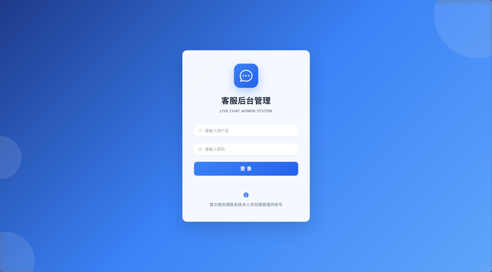
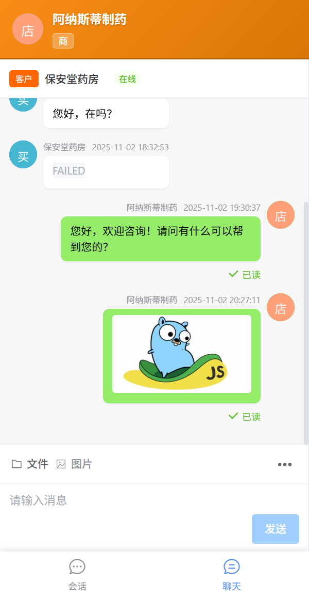

# 在线客服系统

基于 FastAPI + MySQL + Vue3 + WebSocket 的实时在线客服系统，支持多角色实时沟通，响应式设计适配手机/平板/桌面。

## ✨ 核心特性

- 🎯 **多角色系统** - 买家、商户、官方客服、管理员
- 💬 **实时通信** - WebSocket 双通道（持久化 + 实时推送）
- 🟢 **在线状态** - 实时显示用户在线/离线
- 🔐 **JWT 认证** - 管理员登录系统（7天免登录）
- 📱 **响应式设计** - 完美适配手机/平板/桌面
- 📎 **文件上传** - 支持图片和文件（按日期存储）
- ⚡ **快捷回复** - 商户快捷消息模板
- 🛡️ **异常处理** - 全局友好错误提示

## 📸 界面预览

### 客服后台管理
#### 登录


#### 首页


### 聊天界面（桌面端）


### 移动端适配




## 🛠️ 技术栈

**后端：** Python 3.11 + FastAPI + MySQL + SQLAlchemy + Alembic + WebSocket  
**前端：** Vue 3 + Vite + Element Plus + Pinia + Vue Router

**详细技术文档：**
- 后端技术详情：[backend/README.md](backend/README.md)
- 前端技术详情：[frontend/README.md](frontend/README.md)

## 📋 环境要求

| 环境 | 版本 | 说明 |
|------|------|------|
| **Python** | 3.11+ | 后端运行环境 |
| **Node.js** | 20+ | 前端运行环境 |
| **pnpm** | 8+ | 推荐的包管理器 |

### 安装 pnpm

```bash
npm install -g pnpm
```

### 浏览器要求
- 支持 ES6+ 语法
- 支持 WebSocket
- 推荐使用 Chrome / Edge / Firefox 最新版本

## 🚀 快速开始

### 1. 克隆项目

```bash
git clone <repository>
cd live_chat
```

### 2. 配置后端

```bash
cd backend

# 安装依赖
pip install -r requirements.txt

# 复制环境变量配置
cp .env.example .env
# 默认配置可直接使用，生产环境需修改 JWT_SECRET_KEY

# 初始化数据库
alembic upgrade head

# 创建管理员账号
python create_admin.py a1 superadmin superadmin123

# 修改默认管理员账号
python change_password.py a2 admin123
```

### 3. 配置前端

```bash
cd frontend

# 安装依赖
pnpm install
```

### 4. 启动服务

```bash
# 后端（终端1）
cd backend
python main.py

# 前端（终端2）
cd frontend
pnpm dev
```

### 5. 访问系统

| 服务 | 地址 | 说明 |
|------|------|------|
| **前端界面** | http://localhost:5173 | 主界面 |
| **API 文档** | http://localhost:8000/docs | Swagger UI |
| **ReDoc 文档** | http://localhost:8000/redoc | ReDoc UI |

## 📖 使用教程

### 快速访问

| 角色 | 访问链接 | 用户名 |
|------|---------|--------|
| 买家 | `http://localhost:5173/chat?user_id=b1` | 保安堂药房 |
| 商户 | `http://localhost:5173/chat?user_id=m1` | 保和堂医药集团 |
| 官方客服 | `http://localhost:5173/chat?user_id=p1` | 官方客服 |
| 管理员 | `http://localhost:5173/login` | admin |

### 内置测试用户

系统启动时会自动创建以下测试用户：

**管理员**
| 用户ID | 用户名 | 访问方式 |
|--------|--------|---------|
| a1, a2 | admin | 通过 `/login` 登录（需先创建账号） |

**买家**
| 用户ID | 用户名 | 说明 |
|--------|--------|------|
| b1 | 保安堂药房 | 传统药房 |
| b2 | 异世界药局 | 现代连锁药局 |

**商户**
| 用户ID | 用户名 | 说明 |
|--------|--------|------|
| m1 | 保和堂医药集团 | 大型医药集团 |
| m2 | 阿纳斯蒂制药 | 神经科学药企 |
| m3 | 梅迪西斯制药 | 天然植物药厂 |

**官方客服**
| 用户ID | 用户名 | 说明 |
|--------|--------|------|
| p1 | 官方客服 | 平台客服 |

### 使用示例

#### 1. 买家咨询商户

```
http://localhost:5173/chat?user_id=b1&target=m1
```

参数说明：
- `user_id=b1`：当前用户为买家 b1
- `target=m1`：自动打开与商户 m1 的会话（不存在时自动创建）

#### 2. 商户接待客户

```
http://localhost:5173/chat?user_id=m1
```

商户登录后，可以看到所有咨询该商户的客户列表。

#### 3. 管理员监控

```
http://localhost:5173/login
```

使用创建的管理员账号登录，可以实时监控所有会话（只读模式）。

#### 4. 测试实时消息

1. 打开两个浏览器窗口
2. 窗口1：访问 `http://localhost:5173/chat?user_id=b1`
3. 窗口2：访问 `http://localhost:5173/chat?user_id=m1`
4. 在任一窗口发送消息，另一窗口会实时收到

## 💡 功能介绍

### 核心功能

#### 1. 多角色系统
- **买家**：可以咨询多个商户
- **商户**：接待多个客户咨询
- **官方客服**：处理平台相关问题
- **管理员**：监控所有会话（只读）

#### 2. 实时通信
- **双通道设计**：HTTP 持久化 + WebSocket 实时推送
- **在线状态**：实时显示用户在线/离线
- **消息推送**：买家/商户互推，管理员自动接收

#### 3. 文件功能
- **图片上传**：支持 JPG、PNG、GIF 格式
- **文件上传**：支持各类文档（PDF、DOC、XLS 等）
- **日期目录**：按 `年/月/日` 自动分类存储

#### 4. 快捷回复
- 商户可预设常用回复
- 一键发送，提高效率

#### 5. 响应式设计
- **手机端**（<768px）：单栏布局 + 底部导航
- **平板端**（768-1023px）：双栏布局
- **桌面端**（≥1024px）：标准三栏布局

## ❓ 常见问题

**Q: 如何创建管理员账号？**  
```bash
cd backend
python create_admin.py <user_id> <username> <password>

# 示例
python create_admin.py a1 admin admin123
```

**Q: 如何修改管理员密码？**  
```bash
cd backend
python change_password.py <user_id> <new_password>

# 示例
python change_password.py a1 new_password_123
```

**Q: 如何修改配置？**  
编辑 `backend/.env` 文件，重启后端服务生效。详见 [backend/README.md](backend/README.md) 中的"环境变量配置"章节。

**Q: 如何重置数据库？**  
```bash
# 回退所有迁移后重新应用
cd backend
alembic downgrade base
alembic upgrade head

# 或者直接在 MySQL 中删除数据库后重建
# DROP DATABASE chat; CREATE DATABASE chat;
# 然后重新执行迁移
alembic upgrade head
```

**Q: 如何管理数据库结构变更？**  
使用 Alembic 进行版本管理，详见 [backend/README.md](backend/README.md) 中的"数据库迁移管理"章节。

**Q: 前端如何访问后端 API？**  
开发环境通过 Vite 代理，生产环境需配置 Nginx 反向代理。详见 [frontend/README.md](frontend/README.md)。

## 🔮 功能规划

### 已完成 ✅
- [x] 多角色系统（买家、商户、客服、管理员）
- [x] 实时通信（WebSocket）
- [x] 在线状态显示
- [x] JWT 管理员认证
- [x] 响应式设计（手机/平板/桌面）
- [x] 文件上传功能
- [x] 快捷回复
- [x] 全局异常处理
- [x] 数据库迁移管理

### 待开发 📋
- [ ] 历史订单管理
- [ ] 买家/商户注册登录
- [ ] 群聊功能
- [ ] 消息撤回
- [ ] 消息搜索
- [ ] 表情包支持
- [ ] 语音消息
- [ ] 视频通话
- [ ] 数据统计报表
- [ ] 消息已读回执优化
- [ ] 离线消息推送
- [ ] 原生移动端 App

### 性能优化 🚀
- [ ] 消息分页加载优化
- [ ] 图片懒加载
- [ ] WebSocket 断线重连优化
- [ ] Redis 缓存集成
- [ ] CDN 静态资源加速

### 运维支持 🔧
- [ ] Docker 容器化
- [ ] CI/CD 自动部署
- [ ] 日志系统优化
- [ ] 监控告警系统
- [ ] 数据库备份策略

## 📅 更新日志

### 2025-11-02
- ✅ 响应式设计（手机/平板/桌面全适配）
- ✅ 用户在线/离线状态系统
- ✅ JWT 管理员登录认证（优化登录页面设计）
- ✅ 全局异常处理
- ✅ 文件上传优化（日期目录 + 原名保留）
- ✅ 静态资源 URL 智能处理（CDN 支持）
- ✅ 环境变量配置系统
- ✅ Alembic 数据库迁移管理（自动追踪模型变更）

### 2025-11-01
- ✅ 前端路由分离（`/chat` 和 `/admin`）
- ✅ RESTful API 规范化
- ✅ 用户ID字符串化
- ✅ 自动创建会话功能

## 📚 相关文档

- **后端技术文档**：[backend/README.md](backend/README.md)
- **前端技术文档**：[frontend/README.md](frontend/README.md)
- **项目开发规范**：[.cursor/rules/project.mdc](.cursor/rules/project.mdc)

